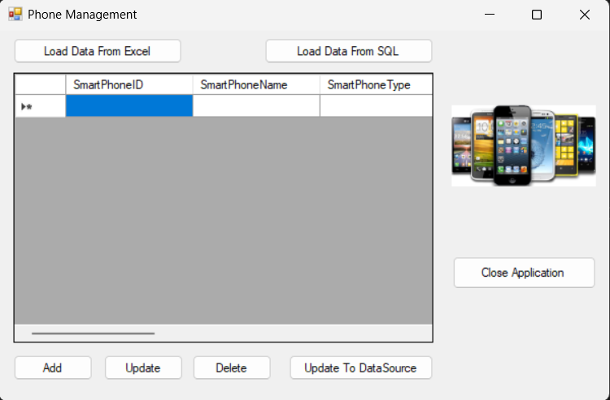

Đây là dự án giúp cho bạn hiểu về cách thiết kế 1 giao diện quản lý điện thoại thông minh với các chức năng cơ bản (add, update, delete, close application). Cũng như biết cách tạo nút và tải dữ liệu cho chương trình từ file Excel hoặc SQL

# PROJECT: Smart Phone Management Project Using C#.
## 1. Description.
This project helps you understand how to design a smartphone management interface with basic functionalities (add, update, delete, close application). It also shows how to create buttons and load data for the program from Excel or SQL files.
## 2. Detailed guide.
### 2.1. Program interface design.
- First, we need to create a new project (here we will be using Microsoft Visual Studio). Then, right-click on the Solution, select Add/New Project/choose Windows Forms App (.NET Framework)/Next (you can rename it at this step)/Create. 
If you don't see Solution Explorer, open View/Solution Explorer or use the keyboard shortcut Ctrl+Alt+L. 
- Next, right-click on Form1.cs in the Solution Explorer and select View Design. 
You will then see a design surface where you can drag and drop and name the objects from the Toolbox (if you don’t see it, you can open it by selecting View/Toolbox or using the keyboard shortcut Ctrl+Alt+X). Then, we obtain the result as shown in the image below: 

