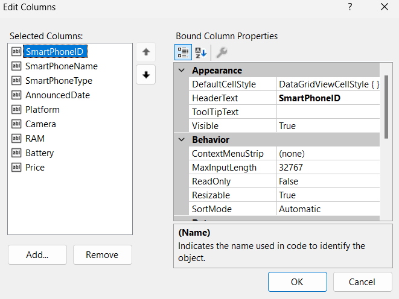
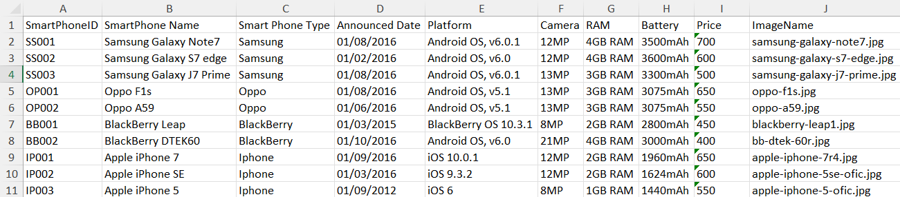
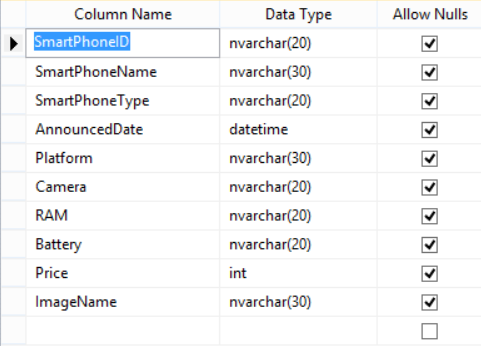
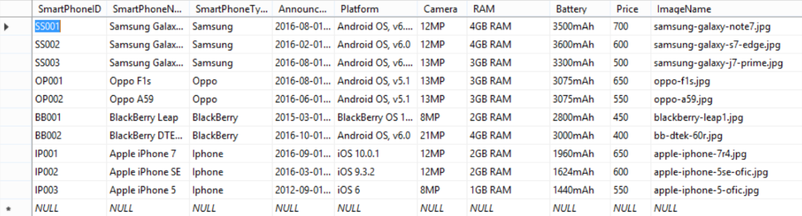

# PROJECT: Smart Phone Management Project Using C#.
## 1. Description.
This project helps you understand how to design a smartphone management interface with basic functionalities (add, update, delete, close application). It also shows how to create buttons and load data for the program from Excel or SQL files.
## 2. Detailed guide.
### 2.1. Program interface design.
- First, we need to create a new project (here we will be using Microsoft Visual Studio). Then, right-click on the Solution, select Add/New Project/choose Windows Forms App (.NET Framework)/Next (you can rename it at this step)/Create. 
If you don't see Solution Explorer, open View/Solution Explorer or use the keyboard shortcut Ctrl+Alt+L. 
- Next, right-click on Form1.cs in the Solution Explorer and select View Design. 
You will then see a design surface where you can drag and drop and name the objects from the Toolbox (if you don’t see it, you can open it by selecting View/Toolbox or using the keyboard shortcut Ctrl+Alt+X). Then, we obtain the result as shown in the image below: 

- Select Edit Columns, adjust parameters like Header Text, DataPropertyName, and (Name) in the Design section.
  
### 2.2. Database Design.
- Create an Excel file named SmartPhoneList.xlsx and place it in the Data folder within the project directory. With data as follows:  

- Open SQL Server Management Studio. Right-click on Database/ New Database/ Enter the database name as SmartPhoneDB. Open the SmartPhoneDB folder/ Right-click on Tables/ New/ Table. Then enter the table attributes as follows:  

- After designing the table, press Ctrl + S and save the table with the name SmartPhone. Then, right-click on the SmartPhone table/ Select Edit Top 200 Rows and enter the data as in the Excel file. 

