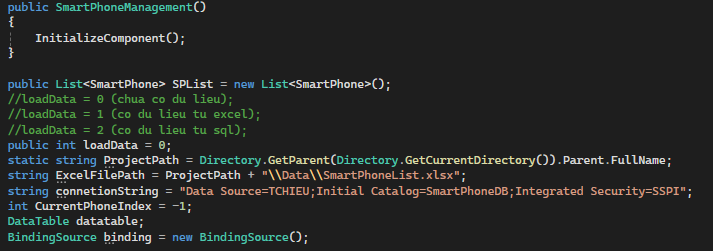
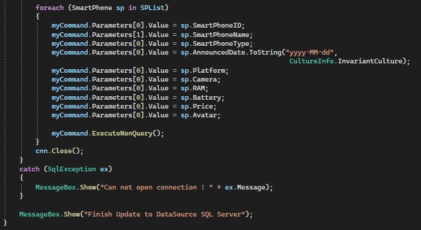

# PROJECT: Smart Phone Management Project Using C#.
## 1. Description.
This project helps you understand how to design a smartphone management interface with basic functionalities (add, update, delete, close application). It also shows how to create buttons and load data for the program from Excel or SQL files.
## 2. Detailed guide.
### 2.1. Program interface design.
- First, we need to create a new project (here we will be using Microsoft Visual Studio). Then, right-click on the Solution, select Add/New Project/choose Windows Forms App (.NET Framework)/Next (you can rename it at this step)/Create. 
If you don't see Solution Explorer, open View/Solution Explorer or use the keyboard shortcut Ctrl+Alt+L. 
- Next, right-click on Form1.cs in the Solution Explorer and select View Design. 
You will then see a design surface where you can drag and drop and name the objects from the Toolbox (if you don’t see it, you can open it by selecting View/Toolbox or using the keyboard shortcut Ctrl+Alt+X). Then, we obtain the result as shown in the image below: 

- Select Edit Columns, adjust parameters like Header Text, DataPropertyName, and (Name) in the Design section.
  
### 2.2. Database Design.
- Create an Excel file named SmartPhoneList.xlsx and place it in the Data folder within the project directory. With data as follows:  

- Open SQL Server Management Studio. Right-click on Database/ New Database/ Enter the database name as SmartPhoneDB. Open the SmartPhoneDB folder/ Right-click on Tables/ New/ Table. Then enter the table attributes as follows:  

- After designing the table, press Ctrl + S and save the table with the name SmartPhone. Then, right-click on the SmartPhone table/ Select Edit Top 200 Rows and enter the data as in the Excel file. 
  
## 3. Declare the data structures to be used in the program.
- Create the SmartPhone class with all the necessary properties for querying and declare the variables needed for the program. Right-click on the Project in Solution Explorer and select Add Class. Name the new class SmartPhone. Write the SmartPhone class with all the necessary properties for querying.  
  
- To interact with Excel files, you need to add a COM reference for Microsoft Excel to your project. From the Visual Studio menu, select Project/ Add Reference/ Search and check Microsoft Excel Object Library/ OK.
- Next, add the necessary namespaces for your application: 
   - "System.IO" is used for commands to search the project directory.
   - "Excel = Microsoft.Office.Interop.Excel" is used for commands to interact with Excel.
   - "System.Globalization" is used for commands to format dates.
   - "System.Data.SqlClient" is used for commands to connect to SQL Server.
- Declare the main variables in the Form1.cs code as follows:  
  
- Note:
   - If SQL Server is accessed using Windows Authentication, you need to provide the following information: Data Source= (Server Name), Initial Catalog= (database name), and Integrated Security=SSPI.
   - If SQL Server is accessed using SQL Server Authentication, you need to provide the following information: Data Source= (Server Name), Initial Catalog= (database name), User ID= (SQL login username), and Password= (SQL Server login password).
   - DataTable and BindingSource are two objects that help us populate data into DataGridView.
## 4. Connect and retrieve data.
### 4.1. Connect and retrieve data from an Excel file.
- Write the ReadDataFromFile function with parameters for the SmartPhone list, the path to the Excel file, and the number of columns to read data from in the Excel file.
- From the SmartPhone list, create a new list that filters and displays less information on the DataGridView.
- Add columns and rows of data from the sublist into the DataTable variable.
- Attach the DataTable to the BindingSource and attach the BindingSource to the DataGridView. The BindingSource is an intermediary object that facilitates communication between the DataGridView and the DataTable. When there are any changes in the DataTable or DataGridView, they will automatically update.
- Implement the SelectionChanged event of the DataGridView so that when a user selects a row in the DataGridView, the corresponding phone image of the selected product is displayed.
- You can refer to the btnLoadExcel_Click event handler and the ReadDataFromFile method in the program I uploaded above.
### 4.2. Connect and retrieve data from SQL Server.
- Similarly, write the ReadDataFromSQLServer function to load data from SQL Server into SmartPhoneList.
- Then, extract a SubList from SPList (SmartPhone List) that contains only the information to be displayed on the DataGridView. Next, load this sublist into a DataTable, attach the DataTable to a BindingSource, and then attach the BindingSource to the DataGridView (similar to the Excel approach).
- You can refer to the btnLoadSQL_Click event handler and the ReadDataFromSQLServer method in the program I uploaded above.
## 5. Add validation when users edit information in the DataGridView.
- Add the EditControlShowing event in the DataGridView.
- Write an additional method ColumnPrice_KeyPress (this is a method you will write yourself). This method will have two parameters: object sender and KeyPressEventArgs e, as it will be called when the user types in the EditControlShowing event in the DataGridView.
## 6. Implement the buttons.
### 6.1. Implement the Add, Delete, Edit, Update and Close application buttons.
- Open the Form1.cs [Design] window and click on the Add, Delete, Edit, Update, and Close application buttons one by one. Then, enter the corresponding code for each event handler
- Add button:  
  
- Delete button: 
 
- Update button: 
  
- Close application button:
  
### 6.2. Perform database update operations.
- When the user presses the 'Update To DataSource' button, all the data in the DataGridView will be transferred to Excel or SQL Server:  
- Check the loadData variable. If it equals 1, update the Excel source; otherwise, update the SQL source.
  
  
  
